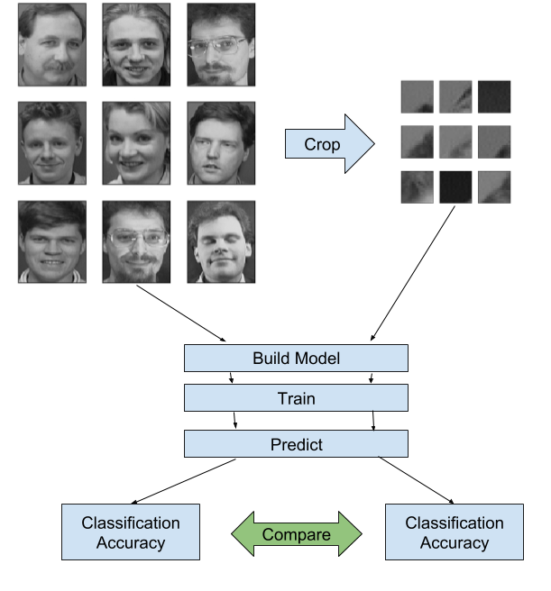

# `dscheck`: Check for background bias in a data set



## Running the tool

Results will be created in `./results/<dataset_name>/<--name>`

```
usage: dscheck.py [-h] [--crop CROP [CROP ...]] [--epochs EPOCHS [EPOCHS ...]]
                  [--nocrop-epochs NOCROP_EPOCHS] [--name NAME]
                  dir

positional arguments:
  dir

optional arguments:
  -h, --help            show this help message and exit
  --crop CROP [CROP ...]
                        The size of the crop in pixels
  --epochs EPOCHS [EPOCHS ...]
                        Number of epochs to test on
  --nocrop-epochs NOCROP_EPOCHS
                        If provided, run the network on the uncropped dataset
  --name NAME           Provide a name for the results directory
```

## Example

```
$ ./dscheck.py datasets/orl --crop 10 15 20 --epochs 80 65 50 --nocrop-epochs 20
```

The above command will run process the data located in the `datasets/orl` directory 4 times. First without any cropping for 20 epochs (`--nocrop-epochs 20`). Then it will run 3 additional times

  1. 10x10 cropped images for 80 epochs
  2. 15x15 cropped images for 65 epochs
  3. 20x20 cropped images for 50 epochs

## ORL Face Dataset Example

